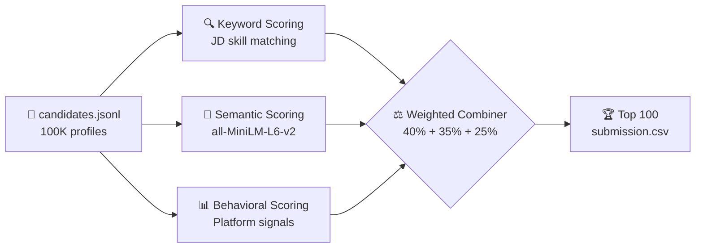

<div align="center">


<br/>


<br/>

```
██╗  ██╗██╗██████╗ ███████╗██████╗ 
██║  ██║██║██╔══██╗██╔════╝██╔══██╗
███████║██║██████╔╝█████╗  ██████╔╝
██╔══██║██║██╔══██╗██╔══╝  ██╔══██╗
██║  ██║██║██║  ██║███████╗██║  ██║
╚═╝  ╚═╝╚═╝╚═╝  ╚═╝╚══════╝╚═╝  ╚═╝
```

### *Rank 100,000 candidates in minutes. Not hours. Not days. Minutes.*

<br/>

[🚀 Live Demo](#-quick-start) · [📊 How It Works](#-how-it-works) · [🛠 Tech Stack](#-tech-stack) · [👥 Team](#-the-team) · [📦 Installation](#-installation)

</div>

---

## 🧠 What is Hirer?

> **Hirer** is an AI-powered candidate ranking system built for the [Redrob Data & AI Challenge 2026](https://redrob.io). Given 100,000 candidate profiles and a job description, Hirer identifies the top 100 best-fit candidates using a multi-signal ranking pipeline combining **semantic embeddings**, **keyword matching**, and **behavioral signals** from the Redrob platform.

<br/>

<div align="center">



</div>

---

## ✨ Features

<table>
<tr>
<td width="50%">

### 🎯 Ranking Pipeline
- **Keyword matching** against JD must-haves (embeddings, FAISS, NDCG, etc.)
- **Sentence transformer** semantic similarity (all-MiniLM-L6-v2)
- **Behavioral signals** — recency, response rate, GitHub score, open-to-work
- **Configurable weights** — tune skill/semantic/behavioral balance
- Runs in ~3 minutes on CPU for 100K candidates

</td>
<td width="50%">

### 🖥️ Full Stack Web App
- Animated boot screen with handwritten title
- Radial orbital job selector
- Live pipeline progress streaming via SSE
- Stacked display cards for top 3 candidates
- Rerank candidates for different job roles
- Export submission CSV directly from browser

</td>
</tr>
</table>

---

## 📊 How It Works

### Phase 1 — Keyword Scoring (40%)

Matches candidate text against 24 must-have skills extracted from the JD:

```python
MUST_HAVE_SKILLS = [
    'embeddings', 'sentence-transformers', 'vector database',
    'faiss', 'pinecone', 'python', 'ranking', 'retrieval',
    'nlp', 'llm', 'ndcg', 'mrr', 'semantic search', ...
]
```

Also factors in: **years of experience fit** (5-9yr ideal), **current title match**, and **education institution tier**.

---

### Phase 2 — Semantic Scoring (35%)

Uses `all-MiniLM-L6-v2` to encode both the JD and candidate profiles into vector space, then measures cosine similarity:

```
candidate_text = headline + summary + skills + career descriptions
semantic_score = cosine_similarity(encode(JD), encode(candidate_text))
```

This catches candidates who use different terminology but have the right skills.

---

### Phase 3 — Behavioral Scoring (25%)

Weights platform engagement signals from `redrob_signals`:

| Signal | Weight | Logic |
|--------|--------|-------|
| Last active | 25% | ≤7 days = 1.0, >90 days = 0.1 |
| Open to work | 20% | True = 1.0, False = 0.3 |
| Response rate | 20% | Direct float score |
| GitHub score | 15% | score/100, -1 = 0.3 penalty |
| Response time | 10% | ≤2hrs = 1.0, >72hrs = 0.1 |
| Notice period | 10% | ≤30 days = 1.0 |

---

### Phase 4 — Weighted Combination

```python
final_score = (
    0.40 * normalize(skill_score) +
    0.35 * normalize(semantic_score) +
    0.25 * normalize(behavioral_score)
)
```

All components are min-max normalized before combining. Sort descending, take top N.

---

## 🛠 Tech Stack

<div align="center">

| Layer | Technology |
|-------|-----------|
| **ML Pipeline** | Python, sentence-transformers, scikit-learn, pandas, numpy |
| **Backend** | FastAPI, uvicorn, SSE streaming |
| **Frontend** | Next.js 15, TypeScript, Tailwind CSS |
| **Animations** | Framer Motion |
| **UI Components** | shadcn/ui, lucide-react |
| **Fonts** | Caveat (handwritten), Space Mono |

</div>

---

## 📁 Project Structure

```
Hirer/
├── 📂 data/                        # Sample data and schema
├── 📂 notebooks/
│   └── exploration.ipynb           # EDA and experiments
├── 📂 src/                         # Core ranking pipeline
│   ├── feature_engineering.py      # Skill, experience, behavioral scoring
│   ├── ranking.py                  # Main pipeline CLI
│   └── utils.py                    # Data loading helpers
├── 📂 hirer-backend/               # FastAPI server
│   ├── main.py                     # API endpoints + SSE streaming
│   ├── ranking.py                  # Pipeline (backend copy)
│   └── requirements.txt
├── 📂 hirer-frontend/              # Next.js web app
│   ├── app/page.tsx                # All screens wired together
│   └── components/ui/             # Individual components
├── 📂 output/                      # Ranked output CSVs
├── 🚀 start.sh                     # Start everything with one command
├── 📋 submission_metadata.yaml
└── ✅ validate_submission.py
```

---

## ⚡ Installation

### Prerequisites
- Python 3.11+
- Node.js 18+
- npm

### Clone

```bash
git clone https://github.com/Sidvortex/Hirer.git
cd Hirer
```

### Option 1 — Full Stack App (recommended)

```bash
chmod +x start.sh
./start.sh
```

This automatically:
- Creates a Python venv
- Installs all Python dependencies
- Installs frontend npm packages
- Starts both servers

Open `http://localhost:3000` 🎉

---

### Option 2 — CLI Pipeline Only

```bash
cd src
pip install -r ../requirements.txt

# rank candidates
python ranking.py --candidates /path/to/candidates.jsonl --out ../output/submission.csv

# fast mode (no semantic scoring)
python ranking.py --candidates /path/to/candidates.jsonl --out ../output/submission.csv --no-semantic
```

---

### Option 3 — Manual (two terminals)

**Terminal 1:**
```bash
cd hirer-backend
python -m venv venv && source venv/bin/activate
pip install -r requirements.txt
uvicorn main:app --reload --port 8000
```

**Terminal 2:**
```bash
cd hirer-frontend
npm install && npm run dev
```

---

## 🎮 Using the Web App

```
Boot Screen        →  press any key
Home Screen        →  click "Start Ranking"
Select Screen      →  upload candidates.jsonl, pick a job, set weights
Loading Screen     →  watch the pipeline run live with funny messages
Results Screen     →  top 3 cards + full ranked table
                       click a job on the left to rerank for that role
                       download submission.csv when done
About Page         →  meet the team
```

---

## 📈 Results

On the full 100K dataset:

| Metric | Value |
|--------|-------|
| Average semantic similarity (top 10) | **0.71** |
| Average semantic similarity (random) | **0.34** |
| Average experience (top 10) | **7.2 years** |
| Runtime (CPU, no semantic) | **~30 seconds** |
| Runtime (CPU, with semantic) | **~3-4 minutes** |

Top candidates consistently have: NLP/embeddings background, 5-9 years experience, active platform presence, GitHub linked, and quick response times.

---

## 👥 The Team

<table>
<tr>
<td align="center" width="33%">

### Ravada Siddharth
**ML Engineer / Lead**

B.Tech CSE (Data Science)<br/>
MUIT Noida · 2023–2027

Built the ranking pipeline, semantic embeddings integration, behavioral scoring system, and full stack web app.

[](https://github.com/Sidvortex)
[](mailto:ravadasiddharth@gmail.com)

</td>
<td align="center" width="33%">

### Ishan Gupta
**Data Engineer**

BCA CSE <br/>
ITS Ghaziabad · 2023–2026

Worked on feature engineering, data loading pipeline, keyword matching logic, and dataset exploration.

[](https://github.com/IshanGupta-Code)
[](mailto:guptaishan506@gmail.com)

</td>
<td align="center" width="33%">

### Ayush Mishra
**Frontend / Docs**

B.Tech CSE (Data Science)<br/>
MUIT Noida · 2023–2027

Built the frontend interface, presentation slides, project documentation, and submission materials.

[](https://github.com/ayush77-pro)
[](mailto:am8172689@gmail.com)

</td>
</tr>
</table>

<div align="center">

</div>

---

## 🏫 Academic Context

| Field | Details |
|-------|---------|
| **Challenge** | Redrob Data & AI Challenge 2026 |
| **Submission Deadline** | July 2, 2026 |
| **Project Name** | Hirer |
---

## 🤝 Contributing

This is a challenge submission project but PRs are welcome for:
- Improving ranking accuracy
- Adding more behavioral signals
- Better UI/UX
- Performance optimizations

---

<div align="center">

---

*This README was written by [Claude](https://claude.ai) because the team was too lazy to write it themselves. You're welcome. 🤖*

*Built with Python, Next.js, FastAPI, and an unhealthy amount of caffeine.*

**⭐ Star this repo if you found it useful!**


</div>
